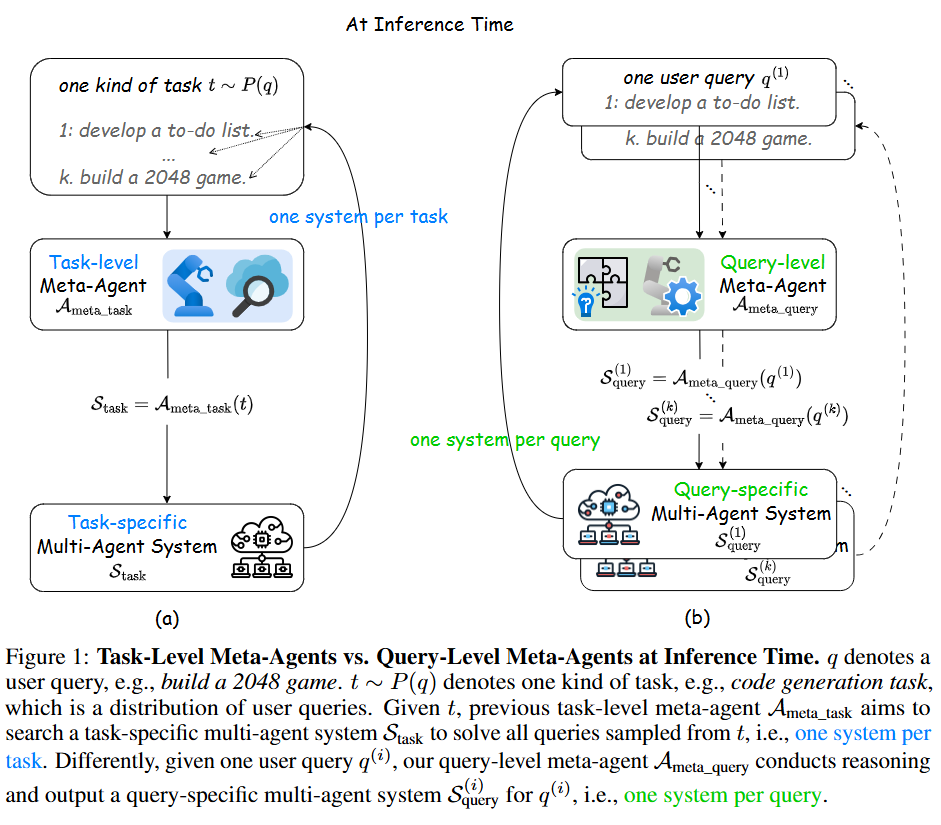
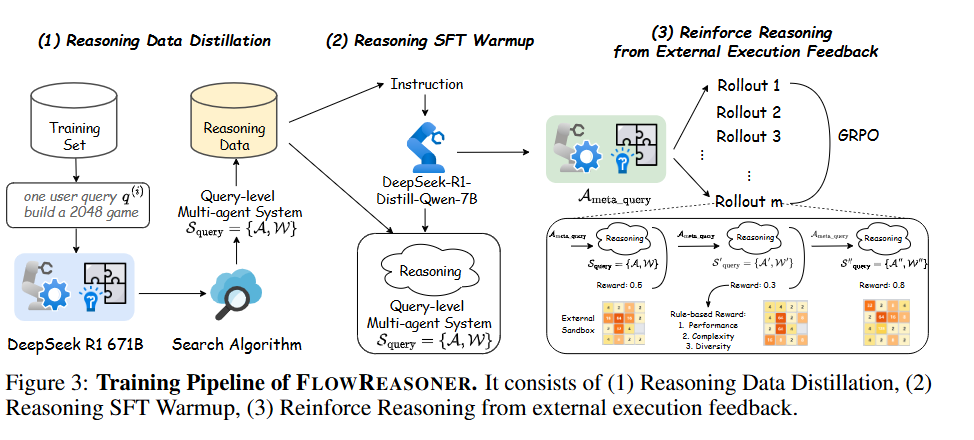

<div align="center">
<h2><a href="">	
FlowReasoner: Reinforcing Query-Level Meta-Agents</a></h2>
    

</a></h2>
[Hongcheng Gao](https://hongcheng-gao.github.io/)<sup>*</sup>, [Yue Liu](https://yueliu1999.github.io/)<sup>\*</sup>, [Yufei He](https://scholar.google.com/citations?user=_3HjpOMAAAAJ&hl=en), [Longxu Dou](https://longxudou.github.io/), [Chao Du](https://duchao0726.github.io/), [Zhijie Deng](https://scholar.google.com/citations?user=J3dR0sUAAAAJ&hl=en), <br> [Bryan Hooi](https://bhooi.github.io/), [Min Lin](https://scholar.google.com.sg/citations?user=BGONmkIAAAAJ&hl=en), [Tianyu Pang](https://p2333.github.io/)

</div>


This paper proposes a query-level meta-agent named FlowReasoner to automate the design of query-level multi-agent systems, i.e., one system per user query. Our core idea is to incentivize a reasoning-based meta-agent via external execution feedback. Concretely, by distilling DeepSeek R1, we first endow the basic reasoning ability regarding the generation of multi-agent systems to FlowReasoner.  Then, we further enhance it via reinforcement learning (RL) with external execution feedback.A multi-purpose reward is designed to guide the RL training from aspects of performance, complexity, and efficiency.  In this manner, FlowReasoner is enabled to generate a personalized multi-agent system for each user query via deliberative reasoning.  Experiments on both engineering and competition code benchmarks demonstrate the superiority of FlowReasoner.  Remarkably, it surpasses o1-mini by $\mathbf{10.52}$\% accuracy across three benchmarks.

<p align="center">



</p>

## Installation

We follow the [MetaGPT](https://github.com/geekan/MetaGPT) to install the required dependencies, please run the following commands:

```shell
git clone https://github.com/sail-sg/FlowReasoner 
cd code
pip install --upgrade -e .
```

*All experiments are conducted on NVIDIA A100 GPUs with 80GB of memory.*

## Configure optimization parameters:
Configure LLM parameters in config/config2.yaml (see examples/FlowReasoner/config2.example.yaml for reference)

```shell
models:
 "<model_name>": # model: "gpt-4-turbo"  # or gpt-3.5-turbo
   api_type: "openai"  # or azure / ollama / groq etc.
   base_url: "<your base url>" 
   api_key: "<your api key>"
   temperature: 0
 "<model_name>":  
   api_type: "openai"  
   base_url: "<your base url>"
   api_key: "<your api key>"
   temperature: 0
CALC_USAGE: True 
```


## Run the inference
### Using default parameters
```shell
python -m examples.FlowReasoner.optimize --dataset MATH
```

### Or with custom parameters
```shell
python -m examples.FlowReasoner.optimize --dataset MATH --sample n --optimized_path xxx ...
```

## Training Stage

<p align="center">



</p>


The SFT dataset is generated by the inference stage. The SFT is conducted by the standard training process using [LLaMA-Factory](https://github.com/hiyouga/LLaMA-Factory) while the RL is based on [EasyRL](https://github.com/alibaba/EasyReinforcementLearning).

## Acknowledgments

This repository is based on the codebase of the [MetaGPT](https://github.com/geekan/MetaGPT), [LLaMA-Factory](https://github.com/hiyouga/LLaMA-Factory), and [EasyRL](https://github.com/alibaba/EasyReinforcementLearning). Thanks for their impressive work!
